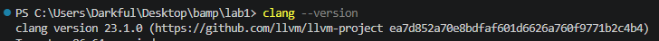
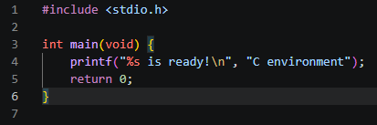
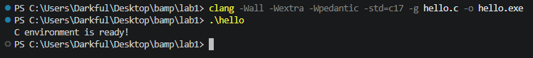
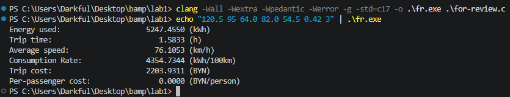
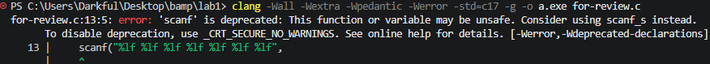
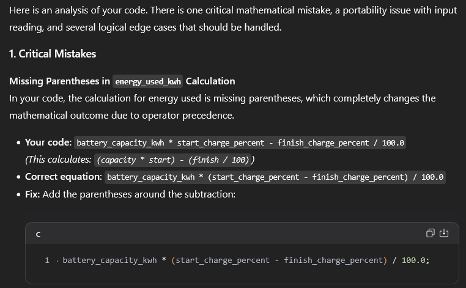
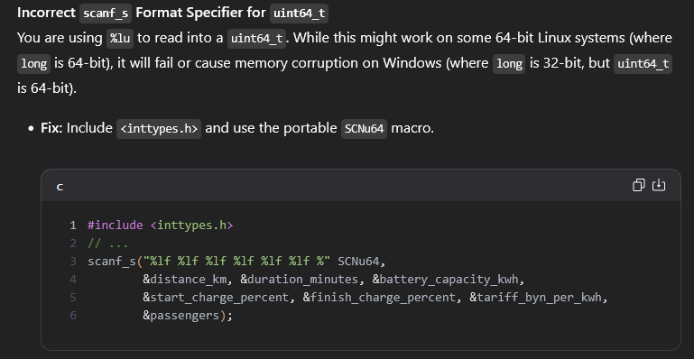
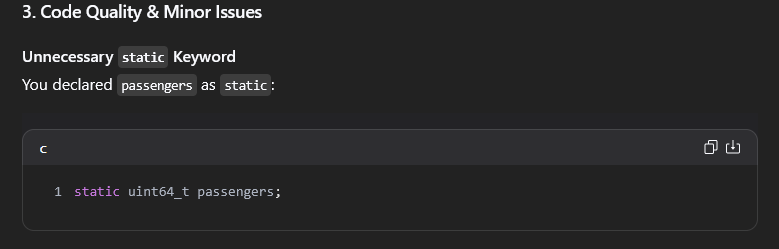
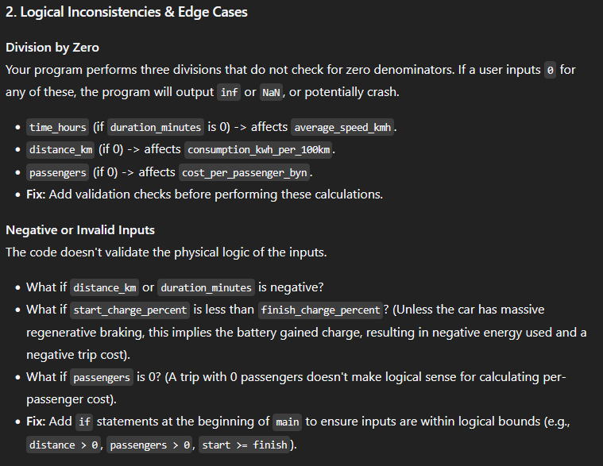
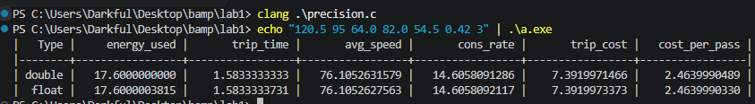

<h1 style="text-align: center; width: 100%"> Лабораторная Работа №1 ОАиП</h1>

<table style="font-size: 150%; border: none; text-align: center; width: 90%; margin: auto">
    <tr style="text-align: center; border:none; border-bottom: 1px solid black; ">
        <th style="border: none">ФИО</th>
        <th style="border: none">Группа</th>
        <th style="border: none">Вариант</th>
        <th style="border: none">Целевая оценка</th>
    </tr>
    <tr style="border:none">
        <td style="border: none">Филиппов Андрей Сергеевич</td>
        <td style="border: none">651001</td>
        <td style="border: none">26</td>
        <td style="border: none">10</td>
    </tr>
</table>

---

## Этап 1. Подготовка рабочего окружения

### Установленное ПО

Для проведения лабораторной работы было установлено следующее ПО:

| Название | Версия | Назначение |
|---|---|---|
| Visual Studio Code | 1.336.2 | Редактор кода |
| Clang (llvm) | 23.1 | Компиллятор языка программирования С /
| Gnu DeBugger | 17.2 | Отладчик программ |

### Проверка установки

Следующие скриншоты подтверждают факт установки и версию ПО.

**Visual Studio Code**


**Clang**


**Gnu DeBugger**


### Диагностическая программа

Для проверки работоспособности окружения была написана простая программа на языке программирования C, выводящая `C environment is ready!` на экран.

Исходный код программы:


```c
#include <stdio.h>

int main(void) {
	printf("%s is ready!\n", "C environment");
	return 0;
}
```

Код программы в Visual Studio Code: 


Компилляция и запуск программы в PowerShell: 


## Этап 2. Постановка задачи

### 2.1 Входные данные

| Имя | Значение | ЕИ | Тип | Ограничение |
|---|---|---|---|---|
| `duration_min` | Длительность | ч | double |
| `distance_km `| Расстояние | км | double |
| `bat_capacity_kWh` | Полная емкость батереи |$\text{кВт} \cdot \text{ч} $ | double |
| `bat_level_start` | Заряд батареи в начале поездки | % | double | $ 0 \leq \text{bat\_level\_start} \leq 100$ |
| `bat_level_finish` | Заряд батареи в конце поездки | % | double | $ 0 \leq \text{bat\_level\_finish} \leq 100$ |
| `energy_tarrif_byn`| Цена электричества |$\text{BYN}/{100 \text{кВт} \cdot \text{ч}}$| double
| `passengers` | Количество пассажиров |чел.| double | $ \text{passengers} \geq 0 $ |

### 2.2 Выходные данные и формулы

| Результат | Формула |
|---|---|
| time_hours | $ \text{duration\_minutes} / 60.0 $ | 
| energy_used_kwh | $ \text{battery\_capacity\_kwh} \times (\text{start\_charge\_percent} - \text{finish\_charge\_percent}) / 100.0 $ |
| average_speed_kmh | $ \text{distance\_km} / \text{time\_hours} $ |
consumption_kwh_per_100| $ \text{km} $| energy_used_kWh / distance_km * 100.0 |
| trip_cost_byn | $ \text{energy\_used\_kwh} \times \text{tariff\_byn\_per\_kwh} $ |
| cost_per_passenger_byn | $ \text{trip\_cost\_byn} / \text{passengers} $ |


<table>
    <tr>
        <th colspan="7" >Входные данные</th>
        <th colspan="6">Выходные данные</th>
    </tr>
    <tr>
        <th> Расстояние</th>
        <th> Длительность</th>
        <th> Полная емкость батереи</th>
        <th> Заряд батареи в начале поездки</th>
        <th> Заряд батареи в конце поездки</th>
        <th> Цена электричества </th>
        <th> Количество пассажиров </th>
        <th> Длительность, в часах</th>
        <th> Использованная энергия</th>
        <th> Средняя скорость </th>
        <th> Потребление энергии на 100км </th>
        <th> Цена</th>
        <th> Цена на человека</th>
    </tr>
    <tr>
		<td>120.5</td>
		<td>95</td>
		<td>64.0</td>
		<td>82.0</td>
		<td>54.5</td>
		<td>0.42</td>
		<td>3</td>
        <td>1.583333</td>
		<td>17.600000</td>
		<td>76.105263</td>
		<td>11.115789</td>
		<td>7.392000</td>
		<td>2.464000</td>
</table>

## Этап 3. Реализация

### 3.1 Технические требования

- [x] Стандарт C17; исходный файл `main.c` с точной входа `main`.
- [x] Для реализации основной логики программы использованы только стандартные функции `scanf()` и `printf()`.
- [x] Для вещественных величин используется `double`  [&#x1f517;IEEE 754 (2008) (pdf)](https://pub.sergev.org/doc/ieee754-2008.pdf)
- [x] Спецификаторы Мформатов `scanf()` и `printf()` корректны для соответствующих переменных
- [x] Имена переменных отражают их смысл
- [x] Сборка под Windows 11 с использованием **Gnu C Compiler** со следующими флагами: `gcc -Wall -Wextra -Wconversion -Wpedantic -Werror -g -std=c17 main.c -o a.exe` выполняется без вывода ошибок и предупреждений.
- [x] Не использованы функции из Windows API, значительно меняющие поведение консольных приложений (e.g. `system("pause")`, библиотека `conio.h` и др.)
  > Стоит отметить, что `exit()`  является стандартной функцией, определённой в стандарте C17, и не затрагивает системных API для управления консолью. Единственное, для чего используется данная функция - досрочное завершение программы при неправильном вводе данных.

## Этап 4. Проверка программы

### 4.1 Минимальный набор тестов

| Тест | Что выявляет |
|---|---|
| T1. Демонстрация | Согласованность программы с эталоном |
| T2. Индивидуальны | й самостоятельное вычисление ожидаемых значений |
| T3. 45 минут | ошибку duration_minutes / 60 при целочисленном делении |
| T4. Дробные | проценты потерю дробной части и неверные скобки |
| T5. Один пассажир | cost_per_passenger должен совпасть с trip_cost |
| T6. Контрастный | малый расход при большой дистанции или короткая поездка; разумность единиц |
| T7. Точность программы (1) | Проверить, является ли точность программы выше 7-8 *значимых знаков*|
| T7. Точность программы (2) | Проверить, является ли точность программы выше 15-20 *значимых знаков*|

<table>
    <tr>
        <th>ID</th>
        <th>Ввод</th>
        <th>Ожидание</th>
        <th>Вывод</th>
        <th>Итог</th>
    <tr>
    <tr>
        <td>T1</td>
        <td><code>120.5 95 64.0 82.0 54.5 0.42 3</code></td>
        <td><code>17.6000 1.5833 76.1053 14.6058 7.3920 2.4640</code></td>
        <td><code>17.6000 1.5833 76.1053 14.6058 7.3920 2.4640</code></td>
        <td style="background-color: #66ee99">PASS</td>
    </tr>
    <tr>
        <td>T2</td>
        <td style="background-color: #ffff3c; text-align: center;">?</td>
        <td style="background-color: #ffff3c; text-align: center;">?</td>
        <td style="background-color: #ffff3c; text-align: center;">?</td>
        <td style="background-color: #ffff3c; text-align: center;">?</td>
    </tr>
    <tr>
        <td>T3</td>
        <td style="background-color: #ffff3c; text-align: center;">?</td>
        <td style="background-color: #ffff3c; text-align: center;">?</td>
        <td style="background-color: #ffff3c; text-align: center;">?</td>
        <td style="background-color: #ffff3c; text-align: center;">?</td>
    </tr>
    <tr>
        <td>T4</td>
        <td style="background-color: #ffff3c; text-align: center;">?</td>
        <td style="background-color: #ffff3c; text-align: center;">?</td>
        <td style="background-color: #ffff3c; text-align: center;">?</td>
        <td style="background-color: #ffff3c; text-align: center;">?</td>
    </tr>
    <tr>
        <td>T5</td>
        <td><code>120.5 95 64.0 82.0 54.5 0.42 1</code></td>
        <td><code>17.6000 1.5833 76.1053 14.6058 7.3920 7.3920</code></td>
        <td><code>17.6000 1.5833 76.1053 14.6058 7.3920 7.3920</code></td>
        <td style="background-color: #66ee99">PASS</td>
    </tr>
    <tr>
        <td>T6</td>
        <td><code>12000.5 0.003 6400.0 82.0 0.5 0.42 123</code></td>
        <td><code>0.0001 5216.0000 240010000.0000 43.4649 2190.7200 17.8107</td>
        <td><code>0.0001 5216.0000 240010000.0000 43.4649 2190.7200 17.8107</td>
        <td style="background-color: #66ee99">PASS</td>
    </tr>
    <tr>
        <td>T7</td>
        <td style="background-color: #ffff3c; text-align: center;">?</td>
        <td style="background-color: #ffff3c; text-align: center;">?</td>
        <td style="background-color: #ffff3c; text-align: center;">?</td>
        <td style="background-color: #ffff3c; text-align: center;">?</td>
    </tr>
    <tr>
        <td>T7</td>
        <td style="background-color: #ffff3c; text-align: center;">?</td>
        <td style="background-color: #ffff3c; text-align: center;">?</td>
        <td style="background-color: #ffff3c; text-align: center;">?</td>
        <td style="background-color: #ffff3c; text-align: center;">?</td>
    </tr>
</table>

<!---
<ol>
    <li><p id="footnote-explanation-1">Так как точность 32-битного float соствляет около 7 значимых десятичных знаков (<a href="https://pub.sergev.org/doc/ieee754-2008.pdf">&#x1f517;IEEE 754 (2008) (pdf)</a>), при использовании его в расчётах с большими числами видна погрешность.</p></li>
</ol>
-->

### Этап 5. Работа с AI

Для работы с AI был использован следующий промпт:

> Hi! You will be reviewing the code of a simple program I've written. It asks the user to input some values and calculates duration of a trip, energy used and energy consumption rate during the trip and its total and per-person cost. Your task is to come up with tests that will expose vulnerabilities, illogical results and other inconsistencies in the program. Your output should be in form of a table, where its first column is index of a test, second is input, third is expected output and fourth is explanation of why the test is important and what it can tell me about the program.
>
> <Код из файла `main.c`>
>
> formulas that are used when computing the results:
>
> time_hours = duration_minutes / 60.0
> energy_used_kwh = battery_capacity_kwh * (start_charge_percent - finish_charge_percent) / 100.0
> average_speed_kmh = distance_km / time_hours
> consumption_kwh_per_100km = energy_used_kwh / distance_km * 100.0
> trip_cost_byn = energy_used_kwh * tariff_byn_per_kwh
> cost_per_passenger_byn = trip_cost_byn / passengers

Ниже представлена таблица из предложений, которые сгенерировал искусственный интеллект и решение о реализации или нереализации их в программе:

| Предложение AI | Решение | Как проверено | Вывод |
|---|---|---|---|
| Добавить проверку возвращаемого значения функции `scanf()` для предотвращения неправильного ввода пользователя | **Отклонено**, *так как противоречит условию лабораторной работы (без ветвлений, пользовательский ввод считать корректным)* | - | - |
| Проверка соответствия значения пользовательского ввода по сравнению с ограничениями | **Отклонено**, *так как противоречит условию лабораторной работы (без ветвлений, пользовательский ввод считать корректным)* | - | - |
| Изменить тип переменной `passengers` на целочисленный | **Принято**, *так как тип переменной накладывает дополнительные ограничения, что помогает понять её назначение* | тесты T1-T7 | Измененние не повлияло на корректность программы, но упростило процесс чтения кода |


### Этап 6. Аудит правдоподобного AI кода

Для проведения данного этапа написанный код был значительно изменён - добавлены как различные уязвимости, так и нелогичные и лишние операции, не позволяющие получить желаемый результат, а именно:
- Отсутствие скобок в расчёте `energy_used_kwh`
- Перепутанная последовательность форматов в форматной строке `scanf_s` (целочисленный для `double` и плавающая точка для `uint64_t`)
- Ненужный спецификатор `static` для переменной `passengers`, который может привести к ошибкам при дальнейшем усложнении кода.

Полученный код был сохранён в файле `for-review.c`, созданный в соответствующей ветке `for-review`, для того, чтобы не повреждать написанную ранее программу.

Для работы с AI был использован следующий промпт:

>Hi! I'm writing a program that will calculate statistics for a trip given some data. The inputs are distance, duration(minutes) of the trip, battery capacity, start and finish levels, energy price and passenger count. Program has to calculate duration (in hours), average speed, battery consumption rate(in kwh per 100km), total energy used during trip, total and per-passenger price. Report any mistakes and/or logical inconsistencies you find. Here's the code sample:
>
> <<<Код из файла `for-review.c` (представлен ниже)>>>
>
> Note: equations for finding needed values are the following:
> 
> time_hours = duration_minutes / 60.0 
> energy_used_kwh = battery_capacity_kwh * (start_charge_percent - finish_charge_percent) / 100.0
> average_speed_kmh = distance_km / time_hours
> consumption_kwh_per_100_km = energy_used_kWh / distance_km * 100.0
> trip_cost_byn = energy_used_kwh * tariff_byn_per_kwh
> cost_per_passenger_byn = trip_cost_byn / passengers

Исходный код, находящийся в файле `for-review.c` перед передачей его ИИ модели:

```c
#include <stdio.h>
#include <stdint.h>

int main(void) {
    double distance_km;
    double duration_minutes;
    double battery_capacity_kwh;
    double start_charge_percent;
    double finish_charge_percent;
    double tariff_byn_per_kwh;
    static uint64_t passengers;

    scanf_s("%lu %lf %lf %lf %lf %lf %lf",
    &distance_km, &duration_minutes, &battery_capacity_kwh, 
    &start_charge_percent, &finish_charge_percent, &tariff_byn_per_kwh,
    &passengers);

    double time_hours = duration_minutes / 60;
    double energy_used_kwh = battery_capacity_kwh * start_charge_percent - finish_charge_percent / 100.0;
    double average_speed_kmh = distance_km / time_hours;
    double consumption_kwh_per_100km = energy_used_kwh / distance_km * 100;
    double trip_cost_byn = energy_used_kwh * tariff_byn_per_kwh;
    double cost_per_passenger_byn = trip_cost_byn / passengers;

    printf("%-30s %10.4lf (%s)\n", "Energy used: ",         (double)energy_used_kwh,           "kWh");
    printf("%-30s %10.4lf (%s)\n", "Trip time:",            (double)time_hours,                "h");
    printf("%-30s %10.4lf (%s)\n", "Average speed:",        (double)average_speed_kmh,         "km/h");
    printf("%-30s %10.4lf (%s)\n", "Consumption Rate: ",    (double)consumption_kwh_per_100km, "kWh/100km");
    printf("%-30s %10.4lf (%s)\n", "Trip cost: ",           (double)trip_cost_byn,             "BYN");
    printf("%-30s %10.4lf (%s)\n", "Per-passenger cost: ",  (double)cost_per_passenger_byn,    "BYN/person");
    return 0;
}
```

#### Ошибки, найденные компиллятором:

Компиллятор не нашёл ошибок в данном фрагменте кода, так как они не являются слишком очевидными или неправильным синтаксисом.



> Стоит отметить, что компиллятор обнаруживает ошибки неправильных форматов в `scanf()`, но не в `scanf_s()`, однако при использовании `scanf_s()` компиллятор выдаёт предупреждение, что делает сборку с флагом `-Werror` невозможной:
> 


##### Ошибки, найденные AI:

| Ошибка | Факт нахождения | Предложенное решение | Оценка предложенного решения | Доказательство |
|---|---|---|---|---|
| Недостающие скобки | &check; | battery_capacity_kwh * (start_charge_percent - finish_charge_percent) / 100.0 | **&check;** Решение является корректным и устраняет логические ошибки в программе. | 
| Неправильные спецификаторы формата `scanf_s` | &check; | Добавить заголовочный файл `<inttypes.h>` для определения переносимого макроса `SCNu64` (формат 64-битного `unsigned int` | **Отклонено** так как заметно снижает читабельность кода, и имеет смысл только при компилляции при помощи стандартов C, вышедших значительно раньше C17. | 
| Ненужный классификатор `static` | &check; | Убрать классификатор `static` перед объявлением переменной | **&check;** Решение является корректным, не влияет на корректность программы, улучшает читаемость кода и устраняет возможные будующие ошибки | 
| *Дополнительно* валидация ввода | &check; | Добавить проверку введенных пользователем данных при помощи `if`-выражений | **Отклонено** из-за условий лабораторной работы (*отсутствие ветвлений*) | 

## Этап 7. Влияние типов данных (float vs. double)

Для этого был создан файл `precision.c`, в котором считались все необходимые значения сначала при помощи `double`, а затем при помощи `float`. Программа вывела следующие значения: 

|   Type |     energy_used |       trip_time |       avg_speed |       cons_rate |       trip_cost |   cost_per_pass |
|--------|-----------------|-----------------|-----------------|-----------------|-----------------|-----------------|
| double |   17.6000000000 |    1.5833333333 |   76.1052631579 |   14.6058091286 |    7.3919971466 |    2.4639990489 |
|  float |   17.6000003815 |    1.5833333731 |   76.1052627563 |   14.6058092117 |    7.3919973373 |    2.4639990330 |

Мы можем заметить, что все неточности возникают на 8-9 *значимом знаке* числа, что полностью соответствует их поведению, описанному в стандарте. Из стандарта [&#x1f517;IEEE 754 (2008) (pdf)](https://pub.sergev.org/doc/ieee754-2008.pdf) можно увидеть, что тип данных `float`(32-bit)  имеет только `23` бита матиссы, соответственно вместимость можно посчитать по следующей формуле:

$$ P = \log_{10} (2^{23}) \approx 6.9236899 $$

Из этого следует, что гарантированно без потери точности тип данных `float` может представить только `6` *значимых знаков* числа. В свою очередь тип `double` имеет `52` бита в качестве мантиссы. По той же формуле получаем, что он может точно представить

$$ P = \log_{10} (2^{52}) \approx 15.653559 $$

`15` знаков после запятой. Из-за данной точности рекомендуется выбирать данный тип данных при его наличии на целевой архитектуре.

$$ \blacksquare $$